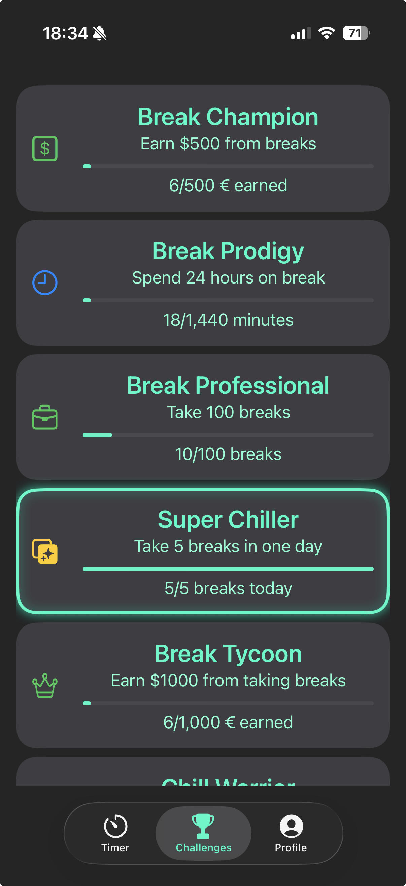
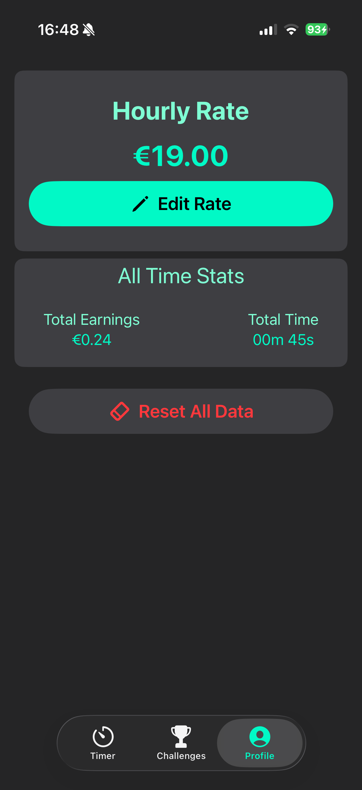

# IdleIncome

> **Work in Progress** – This app is currently under development.

IdleIncomee is a playful yet practical app that helps you track how much money you earn while taking breaks at work, whether it's a coffee break or a quick restroom stop. Set your hourly rate, start a break, and watch your earnings grow in real time!

---

## Features

- Set your **hourly rate**.  
- Start and stop breaks.  
- Track **earnings in real-time** while on break.  
- View **daily, weekly, monthly, and lifetime earnings**.  
- Track total **time spent on breaks**.  

---

## Screenshots

  
  
  

---

## How It Works

1. Open the app and set your **hourly rate**.  
2. Tap **Start Break** to begin tracking your break time.  
3. Earnings are calculated automatically based on the time elapsed and your hourly rate.  
4. Tap **Stop Break** to add the earnings from the break to your daily, weekly, monthly, and lifetime totals.  
5. Use the **Profile** tab to view all-time stats and adjust your hourly rate.  

---

## Tech Stack

- **SwiftUI** – User interface framework  
- **Combine** – Reactive updates for earnings and timers  
- **iOS** – Targeted for iPhone/iPad  

---

## Work In Progress

- More detailed statistics and challenges to gamify breaks.  
- Automatic reset of daily, weekly, and monthly earnings.  
- Improved UI/UX for tracking multiple breaks per day.  

---

## License

This project is open source and free to use.  
